<h1 align="center">🤖 Hey, I’m Fadhil — a.k.a. SunStrinq 🌅</h1>
<h3 align="center">Mobile Engineer ➜ Embedded Systems Engineer (in progress)</h3>

  <em>I build engineered systems — from mobile apps to bare-metal firmware.</em>

  <em>Making things unique while still being functional.</em>

---

### 🚀 About Me

Hi! I’m Fadhil — a **Mobile Engineer** transitioning into **Embedded Systems & Firmware**.

At **sunstrinq**, my personal engineering studio, I explore how **software engineering, digital logic, and hardware constraints** come together to build systems that **run efficiently, reliably, and close to the metal**.

- **Current:** Crafting elegant mobile interfaces while diving deep into the bits and bytes of hardware control.
- **Focus:** Transitioning into **Firmware**, **RTOS**, and **Low-Level Architecture**.
- **Mission:** To bridge the gap between abstract software and physical hardware, optimizing for performance, power, and precision.

If you’re curious about my journey into advanced engineering, connect here:  
[LinkedIn](https://www.linkedin.com/in/ridhanf) •
[Kaggle](https://www.kaggle.com/ridhanf) •
[LeetCode](https://leetcode.com/u/ridhanf/) •
[Codewars](https://www.codewars.com/users/ridhanf) •
[HackerRank](https://www.hackerrank.com/ridhanf)

---

<!--
### 🛠 Languages & Tools I Play With

**Languages**

**Tech Stack**

**Learning** \
`Modern C++` `FreeRTOS` `Embedded Linux` `STM32` `Drivers`

---
-->

<!-- ### 📊 My GitHub Stats -->

<!-- 
 -->

---
