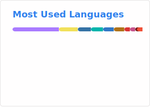
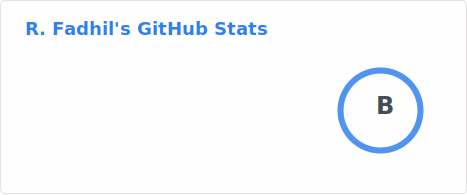

  
  

<h1 align="center">Hey, I’m Fadhil — a.k.a. hightechif</h1>

  <strong>Mobile Product Engineer & AI Integrator</strong>

  <em>Building intuitive mobile experiences connected to cognitive foundation models.</em>

  
  
  
  
  

---

### 🚀 About Me

I am a **Mobile Engineer** expanding my focus to **AI Product Engineering & API Orchestration**.

Through **hightechif**, my personal engineering studio, I explore how software engineering, foundation models, and user experiences converge to build intelligent, interactive digital products.

- **🔭 Current Focus**: Designing context-aware mobile interfaces that integrate model APIs and cognitive workflows.
- **🧠 Deep Dive**: Developing orchestration layers, Retrieval-Augmented Generation (RAG), and agentic workflows.
- **🎯 Mission**: Bridging advanced foundation models and client applications to deliver smart, highly responsive digital products.

---

### 🛠 Tech Stack & Tools

#### 🎯 AI & LLM Orchestration (Active Learning)

  
  
  
  
  
  

#### 💻 Programming Languages

  
  
  
  

#### ⚙️ Frameworks & Infrastructure

  
  
  
  
  

---

### 📊 GitHub Stats

  

<!--

  
  

-->

---
